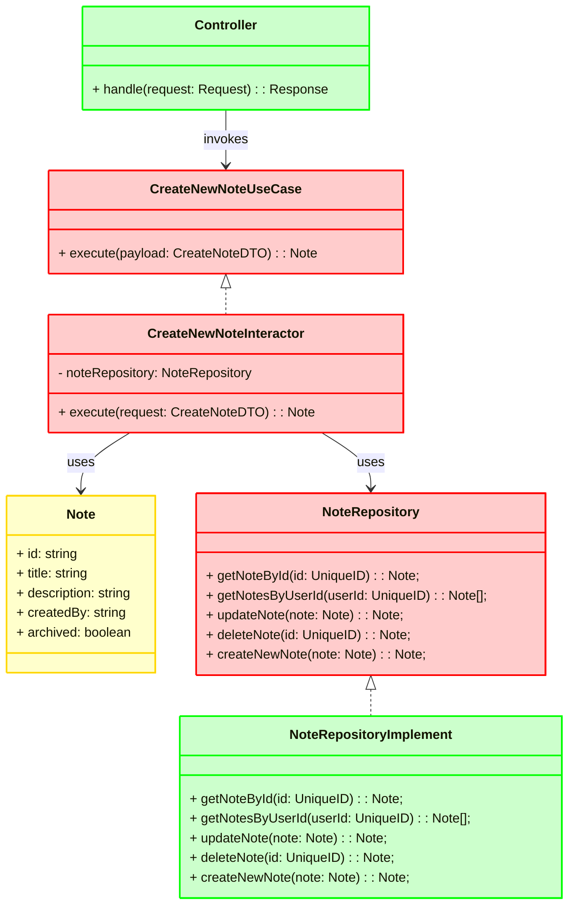

# >> Note

This class diagram shows the code-level structure of the "Create Note" use case.

```mermaid
classDiagram
  direction TB
  class Note {
      + id: string
      + title: string
      + description: string
      + createdBy: string
      + archived: boolean
  }

  class CreateNewNoteUseCase {
      + execute(payload: CreateNoteDTO): Note
  }

  class CreateNewNoteInteractor {
      - noteRepository: NoteRepository
      + execute(request: CreateNoteDTO): Note
  }

  class NoteRepository {
      + getNoteById(id: UniqueID): Note;
      + getNotesByUserId(userId: UniqueID): Note[];
      + updateNote(note: Note): Note;
      + deleteNote(id: UniqueID): Note;
      + createNewNote(note: Note): Note;
  }

  class Controller {
      + handle(request: Request): Response
  }

  class NoteRepositoryImplement {
      + getNoteById(id: UniqueID): Note;
      + getNotesByUserId(userId: UniqueID): Note[];
      + updateNote(note: Note): Note;
      + deleteNote(id: UniqueID): Note;
      + createNewNote(note: Note): Note;
  }

  CreateNewNoteUseCase <|.. CreateNewNoteInteractor
  CreateNewNoteInteractor --> NoteRepository : uses
  CreateNewNoteInteractor --> Note : uses
  Controller --> CreateNewNoteUseCase : invokes
  NoteRepository <|.. NoteRepositoryImplement

  %% Add custom class for styling
  style Note fill:#ffffcc,stroke:#ffd700,stroke-width:2px
  style CreateNewNoteUseCase fill:#ffcccc,stroke:#ff0000,stroke-width:2px
  style CreateNewNoteInteractor fill:#ffcccc,stroke:#ff0000,stroke-width:2px
  style NoteRepository fill:#ffcccc,stroke:#ff0000,stroke-width:2px
  style Controller fill:#ccffcc,stroke:#00ff00,stroke-width:2px
  style NoteRepositoryImplement fill:#ccffcc,stroke:#00ff00,stroke-width:2px

```
