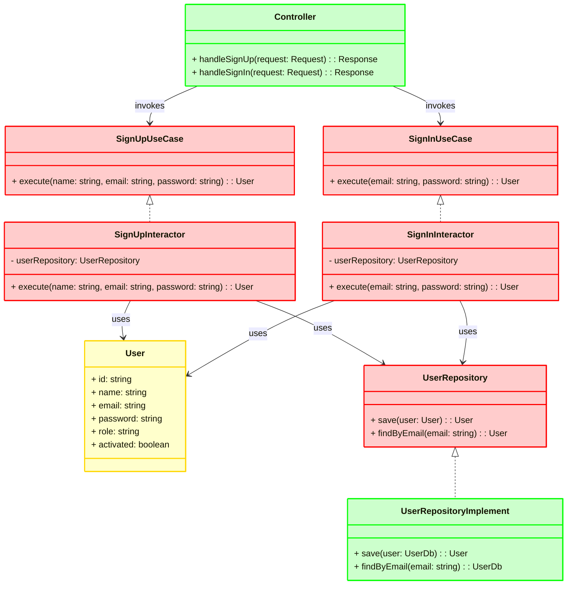

# >> User

This class diagram shows the code-level structure of the "Sign-In" and "Sign-Up" use case.

```mermaid

classDiagram
  direction TB

  %% Domain Entity
  class User {
      + id: string
      + name: string
      + email: string
      + password: string
      + role: string
      + activated: boolean
  }

  %% Use Cases (Interfaces)
  class SignUpUseCase {
      + execute(name: string, email: string, password: string): User
  }

  class SignInUseCase {
      + execute(email: string, password: string): User
  }

  %% Interactors (Implementation of Use Cases)
  class SignUpInteractor {
      - userRepository: UserRepository
      + execute(name: string, email: string, password: string): User
  }

  class SignInInteractor {
      - userRepository: UserRepository
      + execute(email: string, password: string): User
  }

  %% Repository Interface
  class UserRepository {
      + save(user: User): User
      + findByEmail(email: string): User
  }

  %% Controller & UserRepositoryImplement
  class Controller {
      + handleSignUp(request: Request): Response
      + handleSignIn(request: Request): Response
  }

  class UserRepositoryImplement {
      + save(user: UserDb): User
      + findByEmail(email: string): UserDb
  }

  %% Relationships
  SignUpUseCase <|.. SignUpInteractor
  SignInUseCase <|.. SignInInteractor

  SignUpInteractor --> UserRepository : uses
  SignUpInteractor --> User : uses

  SignInInteractor --> UserRepository : uses
  SignInInteractor --> User : uses

  Controller --> SignUpUseCase : invokes
  Controller --> SignInUseCase : invokes

  UserRepository <|.. UserRepositoryImplement

  %% Styles
  style User fill:#ffffcc,stroke:#ffd700,stroke-width:2px
  style SignUpUseCase fill:#ffcccc,stroke:#ff0000,stroke-width:2px
  style SignInUseCase fill:#ffcccc,stroke:#ff0000,stroke-width:2px
  style SignUpInteractor fill:#ffcccc,stroke:#ff0000,stroke-width:2px
  style SignInInteractor fill:#ffcccc,stroke:#ff0000,stroke-width:2px
  style UserRepository fill:#ffcccc,stroke:#ff0000,stroke-width:2px
  style Controller fill:#ccffcc,stroke:#00ff00,stroke-width:2px
  style UserRepositoryImplement fill:#ccffcc,stroke:#00ff00,stroke-width:2px
```
